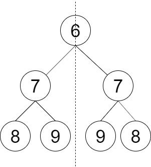

<!--
 * @Author: huangqianfei
 * @Date: 2023-09-23 19:21:38
 * @LastEditTime: 2023-09-23 19:22:00
 * @Description: 
-->
判断对称二叉树


```cpp
class Solution {
public:

    bool judge(TreeNode* t1, TreeNode* t2) {
        if (t1 == nullptr && t2 == nullptr) {
            return true;
        }
        if (t1 == nullptr || t2 == nullptr) {
            return false;
        }
        if (t1->val != t2->val) {
            return false;
        }

        return judge(t1->left, t2->right) && judge(t1->right, t2->left);
    }
    bool checkSymmetricTree(TreeNode* root) {
        if (root == nullptr) {
            return true;
        }

        bool flag = judge(root, root);
        return flag;

    }
};

```