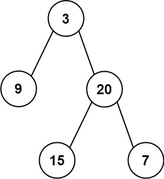

<!--
 * @Author: huangqianfei
 * @Date: 2023-08-31 21:55:00
 * @LastEditTime: 2023-08-31 22:14:21
 * @Description: 
-->
输入某二叉树的前序遍历和中序遍历的结果，请构建该二叉树并返回其根节点。

假设输入的前序遍历和中序遍历的结果中都不含重复的数字。



Input: preorder = [3,9,20,15,7], inorder = [9,3,15,20,7]
Output: [3,9,20,null,null,15,7]

* 时间复杂度：O(n)
* 空间复杂度：O(n)
```cpp
vector<int> make_order(int start, int end, vector<int>& arr) {
    vector<int> temp;
    for (int i = start; i < end; ++i) {
        temp.push_back(arr[i]);
    }
    return temp;
}
TreeNode* buildTree(vector<int>& preorder, vector<int>& inorder) {
    if (preorder.size() == 0 || inorder.size() == 0) {
        return nullptr;
    }

    int root_value = preorder[0];
    int index = 0;
    for (index = 0; index < inorder.size(); ++index) {
        if (root_value == inorder[index]) {
            break;
        }
    }

    TreeNode* root = new TreeNode(root_value);
    vector<int> pre_left = make_order(1, index + 1, preorder);
    vector<int> inorder_left = make_order(0, index, inorder);
    root->left = buildTree(pre_left, inorder_left);
    vector<int> pre_right = make_order(index + 1, preorder.size(), preorder);
    vector<int> inorder_right = make_order(index + 1, inorder.size(), inorder);
    root->right = buildTree(pre_right, inorder_right);

    return root;
}

```