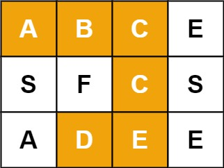

<!--
 * @Author: huangqianfei
 * @Date: 2023-09-05 08:19:15
 * @LastEditTime: 2023-09-05 08:21:44
 * @Description: 
-->
给定一个 m x n 二维字符网格 board 和一个字符串单词 word 。如果 word 存在于网格中，返回 true ；否则，返回 false 。

单词必须按照字母顺序，通过相邻的单元格内的字母构成，其中“相邻”单元格是那些水平相邻或垂直相邻的单元格。同一个单元格内的字母不允许被重复使用。

 

例如，在下面的 3×4 的矩阵中包含单词 "ABCCED"（单词中的字母已标出）。



示例 1：

输入：board = [["A","B","C","E"],["S","F","C","S"],["A","D","E","E"]], word = "ABCCED"
输出：true
示例 2：

输入：board = [["a","b"],["c","d"]], word = "abcd"
输出：false


解法：dfs
```cpp
class Solution {
public:
    vector<vector<bool>> vis;
    int index = 0;
    bool exist(vector<vector<char>>& board, string word) {
        int row = board.size();
        int col = board[0].size();
        vis.resize(row);

        for (int i = 0; i < row; ++i) {
            vis[i].resize(col);
        }

        bool flag = false;
        for (int i = 0; i < row; ++i) {
            for (int j = 0; j < col; ++j) {
                if (board[i][j] == word[0]) {
                    flag = dfs (board, i, j, word, row, col);
                    if (flag) {
                        return flag;
                    }
                }
            }
        }
        return flag;
    }

    bool dfs(vector<vector<char>>& board, int i, int j, string word, int row, int col) {
        if (index == word.size()) {
            return true;
        }
        if (i < 0 || i >= row || j >= col || j < 0 || board[i][j] != word[index] || vis[i][j]) {
            return false;
        }
        ++index;
        vis[i][j] = true;
        bool flag = dfs(board, i + 1, j, word, row, col) ||
                    dfs(board, i - 1, j, word, row, col) ||
                    dfs(board, i, j + 1, word, row, col) ||
                    dfs(board, i, j - 1, word, row, col);
        if (!flag) {
            --index;
            vis[i][j] = false;
        }

        return flag;
    }
};

```